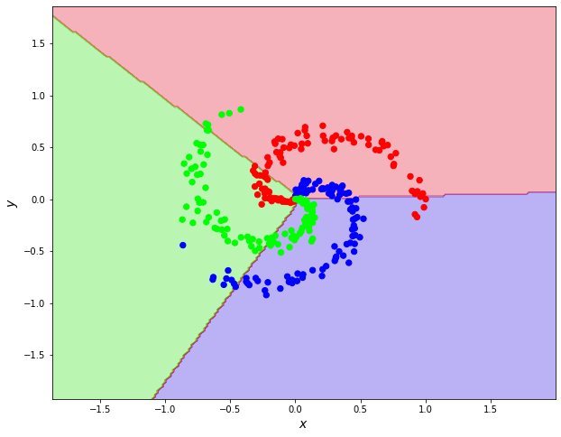

# getting-to-know-pytorch
## pytorch| lt-lesson2
### In this repository we acquainted with PYTORCH 
1. In the first task we  
2. In the second task [pytorch-classifier](https://github.com/olexsahka/getting-to-know-pytorch-lesson2/blob/master/pytorch-classifier.ipynb), we can predict points in 2dplace, with 2 parametrs muzzle width and color tone of the creature

3. In the third task[pytorch-classifier2](https://github.com/olexsahka/getting-to-know-pytorch-lesson2/blob/master/pytorch-classifier2.ipynb )  we  can predict on 3 classes

